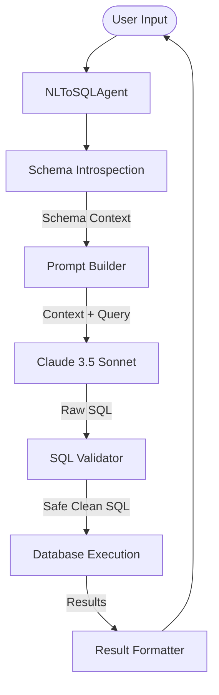

# NL-to-SQL Agent

A robust Natural Language to SQL agent that empowers non-technical users to query business analytics data using plain English. Built with Python, PostgreSQL, and Anthropic's Claude 3.5 Sonnet.

## 📋 Overview

This agent acts as an intelligent bridge between human questions and your database. It handles the complex logic of:
1.  Introspecting your database schema.
2.  Understanding natural language questions.
3.  Generating valid, safe SQL queries using an LLM.
4.  Executing queries and formatting results.
5.  Auto-recovering from SQL errors.

## 🏗️ Architecture

The application follows a linear pipeline architecture:



### Key Components

*   **`agent.py`**: The core controller. Manages the interactive loop, handles retries, and coordinates the flow between components.
*   **`schema_introspection.py`**: Connects to PostgreSQL to extract table metadata, column types, and foreign key relationships. Defines the "schema context" sent to the LLM.
*   **`prompts.py`**: Constructs the prompt engineering layer, injecting schema context, system instructions, and few-shot examples.
*   **`sql_validator.py`**: A security layer that ensures only `SELECT` statements are executed and attempts to prevent common SQL injection patterns.

### Experimental Files
*   `clickhouse_schema_introspection.py`: Experimental support for Clickhouse (currently not active in main flow).

## 🚀 Getting Started

### Prerequisites
*   Python 3.8+
*   PostgreSQL Database
*   Anthropic API Key

### Installation

1.  **Clone the repository**
2.  **Install dependencies**
    ```bash
    pip install -r requirements.txt
    ```

### Configuration

Create a `.env` file in the root directory with the following variables:

| Variable | Description | Required | Default |
|----------|-------------|:--------:|:-------:|
| `ANTHROPIC_API_KEY` | Your Anthropic API Key | Yes | - |
| `DB_HOST` | PostgreSQL Hostname | Yes | - |
| `DB_PORT` | PostgreSQL Port | Yes | - |
| `DB_NAME` | Database Name | Yes | - |
| `DB_USER` | Database Username | Yes | - |
| `DB_PASSWORD` | Database Password | Yes | - |
| `MAX_RETRIES` | Max attempts to fix failed SQL | No | 3 |
| `QUERY_TIMEOUT` | Query timeout in seconds | No | 30 |

## 💻 Usage

To start the interactive agent shell:

```bash
python agent.py
```

### Commands
*   Type your question in plain English (e.g., "How many customers are in New York?")
*   `schema`: View the currently loaded schema context.
*   `exit`, `quit`, `q`: Exit the program.

## ⚠️ Limitations & Known Issues

1.  **Hardcoded Relationships**: The `SchemaIntrospection` class currently has hardcoded foreign key relationships (`RELATIONSHIP SUMMARY`) tailored for a specific e-commerce schema (customers, orders, etc.). This needs to be generalized for use with arbitrary databases.
2.  **Hardcoded Few-Shot Examples**: The `prompts.py` file contains static few-shot examples relevant only to the current specific domain.
3.  **Ambiguity Handling**: While provisions exist for clarifying questions (`get_clarification_prompt`), they are not currently utilized in the main execution loop.
4.  **Clickhouse Support**: Support for Clickhouse is currently experimental and not integrated into the main `NLToSQLAgent` class.
