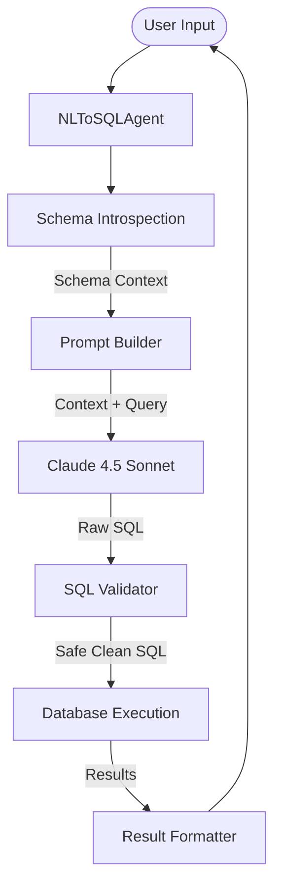
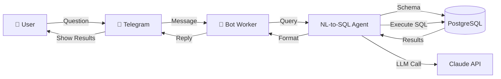

# NL-to-SQL Agent

A robust Natural Language to SQL agent that empowers non-technical users to query business analytics data using plain English. Available as both a **CLI tool** and a **Telegram bot**. Built with Python, PostgreSQL, and Anthropic's Claude 4.5 Sonnet.

## 📋 Overview

This agent acts as an intelligent bridge between human questions and your database. It handles the complex logic of:
1.  Introspecting your database schema.
2.  Understanding natural language questions.
3.  Generating valid, safe SQL queries using an LLM.
4.  Executing queries and formatting results.
5.  Auto-recovering from SQL errors.

**New**: Deploy as a Telegram bot for easy team access! 🤖

## 🎮 Live Demo

Try the bot now: **[@bon_nl_to_sql_poc_bot](https://t.me/bon_nl_to_sql_poc_bot)**

Send `/start` to begin querying the sample e-commerce database!

## 🏗️ Architecture

### CLI Mode

```mermaid
graph TD
    User([User Input]) --> Agent[NLToSQLAgent]
    Agent --> Schema[Schema Introspection]
    Schema -->|Schema Context| Prompt[Prompt Builder]
    Prompt -->|Context + Query| LLM[Claude 4.5 Sonnet]
    LLM -->|Raw SQL| Validator[SQL Validator]
    Validator -->|Safe Clean SQL| Exec[Database Execution]
    Exec -->|Results| Formatter[Result Formatter]
    Formatter --> User
```

### Telegram Bot Mode (New!)

```mermaid
graph LR
    User[👤 User] -->|Question| Telegram[💬 Telegram]
    Telegram -->|Message| Bot[🤖 Bot Worker]
    Bot -->|Query| Agent[NL-to-SQL Agent]
    Agent -->|Schema| DB[(PostgreSQL)]
    Agent -->|LLM Call| Claude[Claude API]
    Agent -->|Execute SQL| DB
    DB -->|Results| Agent
    Agent -->|Format| Bot
    Bot -->|Reply| Telegram
    Telegram -->|Show Results| User
```

### Key Components

*   **`agent.py`**: The core controller. Manages query processing, handles retries, and coordinates the flow between components.
*   **`bot_telegram.py`**: Telegram bot interface for public/team access.
*   **`schema_introspection.py`**: Connects to PostgreSQL to extract table metadata, column types, and foreign key relationships.
*   **`prompts.py`**: Constructs the prompt engineering layer, injecting schema context, system instructions, and few-shot examples.
*   **`sql_validator.py`**: A security layer that ensures only `SELECT` statements are executed and attempts to prevent common SQL injection patterns.

### Experimental Files
*   `clickhouse_schema_introspection.py`: Experimental support for Clickhouse (currently not active in main flow).

## 🚀 Getting Started

### Prerequisites
*   Python 3.8+
*   PostgreSQL Database
*   Anthropic API Key
*   (Optional) Telegram account for bot deployment

### Installation

1.  **Clone the repository**
2.  **Install dependencies**
    ```bash
    pip install -r requirements.txt
    ```

### Configuration

Create a `.env` file in the root directory with the following variables:

| Variable | Description | Required | Default |
|----------|-------------|:--------:|:-------:|
| `ANTHROPIC_API_KEY` | Your Anthropic API Key | Yes | - |
| `DB_HOST` | PostgreSQL Hostname | Yes | - |
| `DB_PORT` | PostgreSQL Port | Yes | - |
| `DB_NAME` | Database Name | Yes | - |
| `DB_USER` | Database Username | Yes | - |
| `DB_PASSWORD` | Database Password | Yes | - |
| `MAX_RETRIES` | Max attempts to fix failed SQL | No | 3 |
| `QUERY_TIMEOUT` | Query timeout in seconds | No | 30 |
| `DB_SSLMODE` | PostgreSQL SSL Mode | No | `require` |
| `DB_CHANNEL_BINDING` | PostgreSQL Channel Binding | No | - |
| `TELEGRAM_BOT_TOKEN` | Telegram bot token (for bot mode) | For bot only | - |
| `TELEGRAM_ALLOWED_USERS` | Comma-separated user IDs | No | - |

## 💻 Usage

### Option 1: CLI Mode (Local)

To start the interactive agent shell:

```bash
python agent.py
```

**Commands:**
*   Type your question in plain English (e.g., "How many customers are in New York?")
*   `schema`: View the currently loaded schema context.
*   `exit`, `quit`, `q`: Exit the program.

### Option 2: Telegram Bot (Public Access)

Deploy your agent as a Telegram bot for team-wide access!

**Quick Start:**
1. Create a bot with [@BotFather](https://t.me/botfather)
2. Get your bot token
3. Add token and database settings to your environment (DigitalOcean or `.env`):

**API Keys:**
```bash
ANTHROPIC_API_KEY=your_claude_key
TELEGRAM_BOT_TOKEN=your_telegram_token
```

**PostgreSQL Connection Options (for Neon):**
```bash
DB_SSLMODE=require
DB_CHANNEL_BINDING=require
```

4. Run locally:
   ```bash
   python bot_telegram.py
   ```
5. Find your bot in Telegram and start chatting!

**Deployment:**
Deploy to DigitalOcean for 24/7 availability (~$5/month):
- See [Telegram Setup Guide](docs/TELEGRAM_SETUP.md)
- See [DigitalOcean Deployment Guide](docs/DIGITALOCEAN_DEPLOYMENT.md)

## 📚 Documentation

- **[Telegram Bot Setup](docs/TELEGRAM_SETUP.md)** - Step-by-step bot creation
- **[Bot Technical Documentation](docs/BOT_TELEGRAM_DOCS.md)** - Architecture and features
- **[DigitalOcean Deployment](docs/DIGITALOCEAN_DEPLOYMENT.md)** - Production deployment guide
- **[Testing Guide](docs/TESTING.md)** - Running and writing tests

### Advanced Configuration (Optional)

You can customize the schema introspection by creating a `schema_config.json` file in the root directory. This allows you to define relationships for databases without Foreign Keys and specify Enum values for columns.

**`schema_config.json` Example:**

```json
{
  "relationships": [
    {
      "source": "customers",
      "target": "orders",
      "description": "one customer can have many orders"
    }
  ],
  "enums": {
    "orders": {
      "status": ["pending", "shipped", "delivered"]
    }
  }
}
```

*   **relationships**: Defines how tables are connected (useful if Foreign Keys are missing).
*   **enums**: Injects allowed values into the prompt, helping the LLM generate correct `WHERE` clauses.

## 🔐 Security Features

- ✅ **Read-only queries**: Only `SELECT` statements allowed
- ✅ **SQL injection protection**: Built-in validation
- ✅ **Query timeouts**: 30-second limit (configurable)
- ✅ **Result limits**: Default 100 rows
- ✅ **User allowlist**: Optional access control for Telegram bot
- ✅ **No data exposure**: All credentials in environment variables

## 🚢 Deployment Options

| Mode | Best For | Cost | Accessibility |
|------|----------|------|---------------|
| **CLI** | Local development, testing | Free | Local only |
| **Telegram Bot (Local)** | Small team, development | Free | Limited (while running) |
| **Telegram Bot (DigitalOcean)** | Production, team access | ~$5-20/month | 24/7 public access |

## 💰 Cost Estimate (Production)

- **DigitalOcean App Platform**: $5/month (basic worker)
- **Anthropic Claude API**: ~$10-50/month (varies by usage)
- **Database**: $0 (if existing) or $15+/month (managed)
- **Total**: ~$20-80/month

## ⚠️ Limitations & Known Issues

1.  **Hardcoded Few-Shot Examples**: The `prompts.py` file contains static few-shot examples relevant only to the current specific domain.
2.  **Ambiguity Handling**: While provisions exist for clarifying questions (`get_clarification_prompt`), they are not currently utilized in the main execution loop.
3.  **Clickhouse Support**: Support for Clickhouse is currently experimental and not integrated into the main `NLToSQLAgent` class.
4.  **Telegram Message Limits**: Results are truncated if they exceed Telegram's 4096 character limit.

## 🤝 Contributing

Contributions are welcome! Areas for improvement:
- Support for additional databases (MySQL, MongoDB, etc.)
- Enhanced error handling and recovery
- Multi-language support for bot
- Result visualization (charts, graphs)
- Query history and analytics

## 📝 License

[Add your license here]

## 🆘 Support

- **Issues**: [GitHub Issues](your-repo-url/issues)
- **Documentation**: See `docs/` folder
- **Telegram Bot Docs**: [BOT_TELEGRAM_DOCS.md](docs/BOT_TELEGRAM_DOCS.md)

---

Built with ❤️ using Python, PostgreSQL, Anthropic Claude, and Telegram
